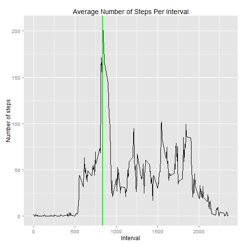
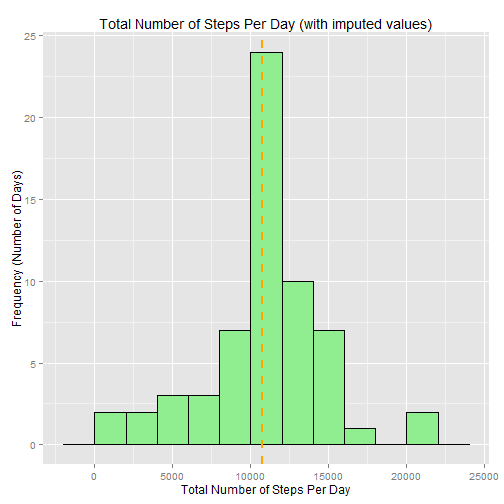
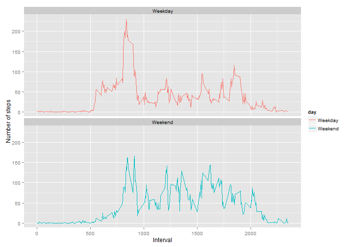

# Reproducible Research: Peer Assessment 1

This assignment makes use of data from a personal activity monitoring device. The device collects data at five-minute intervals throughout the day. The data consists of two months of data from an anonymous individual collected during the months of October and November, 2012 and include the number of steps taken in five-minute intervals each day.

## Data

The data for this assignment can be downloaded from the course web site at the following location:
https://d396qusza40orc.cloudfront.net/repdata%2Fdata%2Factivity.zip

The variables included in this dataset are:

* steps: Number of steps taking in a five-minute interval (missing values are coded as 'NA')

* date: The date on which the measurement was taken in YYYY-MM-DD format

* interval: Identifier for the five-minute interval in which measurement was taken

The dataset is stored in a comma-separated-value (CSV) file format and contains a total of 17,568 observations.


## Loading and preprocessing the data

Set the environment for the working directory. Download the data if not present. In this case the data file "activity.zip" existed, so unzipped the compressed file into the working directory. After examining the "activity.csv" file I decided to consider the variables "steps"" and "interval"" as numeric type and "date"" as Date type. I found no other additional preprocessing at the moment.


```r
setwd("D:/Coursera/RepData_PeerAssessment1")
# Libraries for plotting (ggplot2) and transforming data (plyr).
library(ggplot2)
library(plyr)

# read in the CSV file
activity <- read.csv("activity.csv", colClasses = c("numeric", "Date", "numeric"))
```

## What is mean total number of steps taken per day?

For this section, the instructions said to "ignore the missing values in the dataset". Therefore, I decided to use aggregate to compute the total number of steps taken each day.

Below is a histogram plot of the total number of steps taken daily with bin interval of 2000 steps, along with a calculation of the mean and median total number taken each day.


```r
# create a data frame containing the sum of steps for each date
stepsperDay <- aggregate(steps ~ date, activity, sum)
# calculate the mean and median total steps per day
mean.stepsperDay <- mean(stepsperDay$steps)
median.stepsperDay <- median(stepsperDay$steps)
# create a histogram using ggplot
ggplot(stepsperDay, aes(x = steps)) + geom_histogram(binwidth=2000, col = "black", fill = "light blue") + labs(title="Total Number of Steps Per Day (excluding missing values)", x = "Total Number of Steps Per Day", y = "Frequency (Number of Days)") + geom_vline(aes(xintercept=mean.stepsperDay), color="red", linetype="dashed", size=1) 
```

 

The mean total number of steps per day is 10766 and the median total number of steps per day is 10765.


## What is the average daily activity pattern?

Below is a time series plot of the 5-minute interval and the average number of steps taken, averaged across all days.


```r
# create a data frame containing the mean number of steps for each interval
avebyInterval <- aggregate(steps ~ interval, activity, mean, na.rm = TRUE)

# determine which 5-minute interval contains the maximum number of steps
max.Steps <- max(avebyInterval$steps)
max.Interval <- avebyInterval[avebyInterval$steps==max(max.Steps),1]

# create a time series plot using ggplot
ggplot(avebyInterval, aes(x = interval, y = steps)) + geom_line() + labs(title = "Average Number of Steps Per Interval", x = "Interval", y = "Number of steps") + geom_vline(aes(xintercept=max.Interval), color="green", size=1) 
```

 

The interval with the maximum number of steps (206) is:  835


## Imputing missing values

Note that there are a number of days/intervals where there are missing values (coded as NA). The presence of missing days may introduce bias into some calculations or summaries of the data. The next code section will compute the missing values. 


```r
# calculate the number of missing values
na.Values <- sum(is.na(activity$steps))
```

The total number of missing values in the dataset is: 2304

The next section of code will create a new dataset (activity.Impute) which is identical to the original dataset (activity), except that the new dataset will have imputed values for any missing values of "steps". To populate missing values, I choose to replace them with the mean value for that 5-minute interval across all days.


```r
# create the new dataset
activity.Impute <- adply(activity, 1, function(xna)
        # check if the "steps" value is missing        
        if (is.na(xna$steps)) {
                # if so, replace the missing value with the mean for that interval                
                xna$steps = round(avebyInterval[avebyInterval$interval == xna$interval, 2])
                xna
        } else {
                xna
        })
```

Below is a histogram plot that uses the new dataset. The histogram of the total number of steps taken daily with bin interval of 2000 steps, along with a calculation of the mean and median total number taken each day.


```r
# create a data frame containing the sum of steps for each date
stepsperDay.Imp <- aggregate(steps ~ date, activity.Impute, sum)

# calculate the mean and median total steps per day
mean.stepsperDayImp <- mean(stepsperDay.Imp$steps)
median.stepsperDayImp <- median(stepsperDay.Imp$steps)

# create a histogram using ggplot
ggplot(stepsperDay.Imp, aes(x = steps)) + geom_histogram(binwidth=2000, col = "black", fill = "light green") + labs(title="Total Number of Steps Per Day (with imputed values)", x = "Total Number of Steps Per Day", y = "Frequency (Number of Days)") + geom_vline(aes(xintercept=mean.stepsperDayImp), color="orange", linetype="dashed", size=1)
```

 

For the new dataset, the mean total number of steps per day is 10766 and the median total number of steps per day is 10762. We observe that the median value has changed due to the extra imputed values for missing data on the estimates of the total daily number of steps.


## Are there differences in activity patterns between weekdays and weekends?

To compare the activity patterns between weekdays and weekends, using the dataset with the filled-in missing values (activity.Impute), perform the following steps:

        1. Split the dataset into two parts - weekdays(Monday - Friday) and weekends(Saturday and Sunday).
        2. Compute the average number of steps per interval for each dataset.
        3. create a panel plot to compare the weekday and weekend datasets.


```r
# Use weekday() function to subset the weekdays and weekends datasets
library(lubridate)
activity.weekday <- subset(activity.Impute, !weekdays(date) %in% c("Saturday", "Sunday"))
activity.weekend <- subset(activity.Impute, weekdays(date) %in% c("Saturday", "Sunday"))

# Compute the average number of steps per interval for each dataset
avgbyInterval.weekday <- aggregate(steps ~ interval, activity.weekday, mean)
avgbyInterval.weekend <- aggregate(steps ~ interval, activity.weekend, mean)

# add labels
avgbyInterval.weekend <- cbind(avgbyInterval.weekend, day = rep("weekend"))
avgbyInterval.weekday <- cbind(avgbyInterval.weekday, day = rep("weekday"))
```

The next code section will combine the datasets back together, specify the levels and create a panel plot to compare the weekday and weekend datasets.


```r
# combine the weekday and weekend datasets and specify the levels
avgbyInterval.week <- rbind(avgbyInterval.weekday, avgbyInterval.weekend)
levels(avgbyInterval.week$day) <- c("Weekday", "Weekend")

# create a plot using ggplot
# ggplot(avgbyInterval.week, aes(x = interval, y = steps)) + geom_line() + facet_grid(day ~ 
#    .) + labs(x = "Interval", y = "Number of steps")
ggplot(avgbyInterval.week, aes(x = interval, y = steps, group=day)) + geom_line(aes(color=day)) + facet_wrap(~ day, nrow=2) + labs(x = "Interval", y = "Number of steps")
```

 

We observe that the weekends tends to have more activities compared to the weekdays. 
